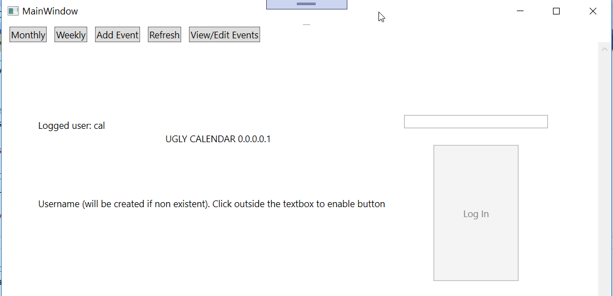
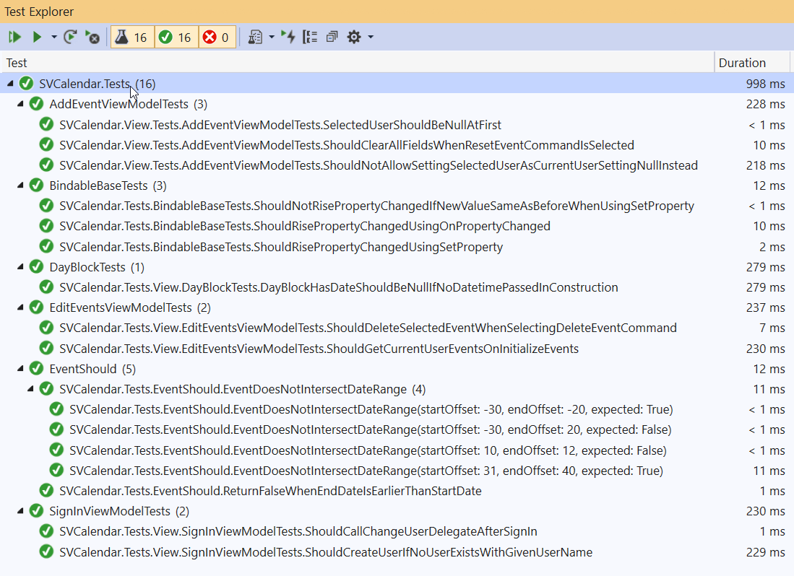
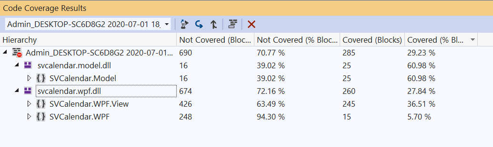

# UGLY CALENDAR
> MVVM WPF .NET Core Desktop application

## Tests
> Tests with xUnit and Moq

### Coverage
> Calculated by Visual Studio 2019 Enterprise 

## Static Analysis
> Reason of why this warnings where ignored in the last column

> Rules applied are in the `.editorconfig` file. [Link](./.editorconfig)

> They are in that file because thats how it's done in .NET Core

| Severity | Code    | Description                                                                                                                                                                                                                                                                                                                                                              | Project          | File                                              | Line | Why ignored                                                                                                  |
|----------|---------|--------------------------------------------------------------------------------------------------------------------------------------------------------------------------------------------------------------------------------------------------------------------------------------------------------------------------------------------------------------------------|------------------|---------------------------------------------------|------|--------------------------------------------------------------------------------------------------------------|
| Warning  | CA1716  | Rename type Event so that it no longer conflicts with the reserved language keyword 'Event'. Using a reserved keyword as the name of a type makes it harder for consumers in other languages to use the type.                                                                                                                                                            | SVCalendar.Model | SVCalendar.Model\Event.cs                         | 6    | It is too late to change the name Event to something else, since all the app revolves arround this name      |
| Warning  | CA2227  | Change 'UserEvents' to be read-only by removing the property setter.                                                                                                                                                                                                                                                                                                     | SVCalendar.Model | SVCalendar.Model\Event.cs                         | 20   | Not true, the program crashes if made readonly. EFCore uses it                                               |
| Warning  | CA1801  | Parameter args of method Main is never used. Remove the parameter or use it in the method body.                                                                                                                                                                                                                                                                          | SVCalendar.Model | SVCalendar.Model\Program.cs                       | 7    | Automatically Generated File                                                                                 |
| Warning  | CA1303  | Method 'void Program.Main(string[] args)' passes a literal string as parameter 'value' of a call to 'void Console.WriteLine(string value)'. Retrieve the following string(s) from a resource table instead: "Hello World!".                                                                                                                                              | SVCalendar.Model | SVCalendar.Model\Program.cs                       | 9    | Automatically Generated File                                                                                 |
| Warning  | CA2227  | Change 'UserEvents' to be read-only by removing the property setter.                                                                                                                                                                                                                                                                                                     | SVCalendar.Model | SVCalendar.Model\User.cs                          | 11   | Not true, the program crashes if made readonly. EFCore uses it                                               |
| Message  | IDE0060 | Remove unused parameter 'args'                                                                                                                                                                                                                                                                                                                                           | SVCalendar.Model | SVCalendar.Model\Program.cs                       | 7    | Automatically Generated File                                                                                 |
| Message  | IDE0017 | Object initialization can be simplified                                                                                                                                                                                                                                                                                                                                  | SVCalendar.Tests | XUnitTestProject\BindableBaseTests.cs             | 26   | Nice suggestion but I think is clearer this way                                                              |
| Message  | IDE0017 | Object initialization can be simplified                                                                                                                                                                                                                                                                                                                                  | SVCalendar.Tests | XUnitTestProject\View\EditEventsViewModelTests.cs | 49   | Nice suggestion but I think is clearer this way                                                              |
| Message  | IDE0017 | Object initialization can be simplified                                                                                                                                                                                                                                                                                                                                  | SVCalendar.Tests | XUnitTestProject\View\SignInViewModelTests.cs     | 45   | Nice suggestion but I think is clearer this way                                                              |
| Warning  | NU1701  | Package 'Extended.Wpf.Toolkit 3.8.1' was restored using '.NETFramework,Version=v4.6.1, .NETFramework,Version=v4.6.2, .NETFramework,Version=v4.7, .NETFramework,Version=v4.7.1, .NETFramework,Version=v4.7.2, .NETFramework,Version=v4.8' instead of the project target framework '.NETCoreApp,Version=v3.1'. This package may not be fully compatible with your project. | SVCalendar.Tests | XUnitTestProject\SVCalendar.Tests.csproj          | 1    | This package works fine in .net core, but is not officially supported                                        |
| Warning  | CA1714  | Flags enums should have plural names                                                                                                                                                                                                                                                                                                                                     | SVCalendar.WPF   | SVCalendar.WPF\Annotations.cs                     | 929  | Automatically Generated File                                                                                 |
| Warning  | CA2217  | Do not mark enums with FlagsAttribute                                                                                                                                                                                                                                                                                                                                    | SVCalendar.WPF   | SVCalendar.WPF\Annotations.cs                     | 929  | Automatically Generated File                                                                                 |
| Warning  | CA1707  | Remove the underscores from member name SVCalendar.WPF.Annotations.AssertionConditionType.IS_TRUE.                                                                                                                                                                                                                                                                       | SVCalendar.WPF   | SVCalendar.WPF\Annotations.cs                     | 972  | Automatically Generated File                                                                                 |
| Warning  | CA1707  | Remove the underscores from member name SVCalendar.WPF.Annotations.AssertionConditionType.IS_FALSE.                                                                                                                                                                                                                                                                      | SVCalendar.WPF   | SVCalendar.WPF\Annotations.cs                     | 974  | Automatically Generated File                                                                                 |
| Warning  | CA1707  | Remove the underscores from member name SVCalendar.WPF.Annotations.AssertionConditionType.IS_NULL.                                                                                                                                                                                                                                                                       | SVCalendar.WPF   | SVCalendar.WPF\Annotations.cs                     | 976  | Automatically Generated File                                                                                 |
| Warning  | CA1707  | Remove the underscores from member name SVCalendar.WPF.Annotations.AssertionConditionType.IS_NOT_NULL.                                                                                                                                                                                                                                                                   | SVCalendar.WPF   | SVCalendar.WPF\Annotations.cs                     | 978  | Automatically Generated File                                                                                 |
| Warning  | CA1812  | MainWindowViewModel is an internal class that is apparently never instantiated. If so, remove the code from the assembly. If this class is intended to contain only static members, make it static (Shared in Visual Basic).                                                                                                                                             | SVCalendar.WPF   | SVCalendar.WPF\MainWindowViewModel.cs             | 7    | It is instantiated via the XAML, but VS is not intelligent enough to notice                                  |
| Warning  | CA1062  | In externally visible method 'void init.Up(MigrationBuilder migrationBuilder)', validate parameter 'migrationBuilder' is non-null before using it. If appropriate, throw an ArgumentNullException when the argument is null or add a Code Contract precondition asserting non-null argument.                                                                             | SVCalendar.WPF   | SVCalendar.WPF\Migrations\20200606130802_init.cs  | 10   | Automatically Generated File                                                                                 |
| Warning  | CA1062  | In externally visible method 'void init.Down(MigrationBuilder migrationBuilder)', validate parameter 'migrationBuilder' is non-null before using it. If appropriate, throw an ArgumentNullException when the argument is null or add a Code Contract precondition asserting non-null argument.                                                                           | SVCalendar.WPF   | SVCalendar.WPF\Migrations\20200606130802_init.cs  | 94   | Automatically Generated File                                                                                 |
| Warning  | CA1030  | Consider making 'RaiseCanExecuteChanged' an event.                                                                                                                                                                                                                                                                                                                       | SVCalendar.WPF   | SVCalendar.WPF\RelayCommand.cs                    | 25   | Library not made by me                                                                                       |
| Warning  | CA1033  | Make 'RelayCommand' sealed (a breaking change if this class has previously shipped), implement the method non-explicitly, or implement a new method that exposes the functionality of 'System.Windows.Input.ICommand.CanExecute' and is visible to derived classes.                                                                                                      | SVCalendar.WPF   | SVCalendar.WPF\RelayCommand.cs                    | 31   | Library not made by me                                                                                       |
| Warning  | CA1033  | Make 'RelayCommand' sealed (a breaking change if this class has previously shipped), implement the method non-explicitly, or implement a new method that exposes the functionality of 'System.Windows.Input.ICommand.Execute' and is visible to derived classes.                                                                                                         | SVCalendar.WPF   | SVCalendar.WPF\RelayCommand.cs                    | 48   | Library not made by me                                                                                       |
| Warning  | CA1030  | Consider making 'RaiseCanExecuteChanged' an event.                                                                                                                                                                                                                                                                                                                       | SVCalendar.WPF   | SVCalendar.WPF\RelayCommand.cs                    | 74   | Library not made by me                                                                                       |
| Warning  | CA1033  | Make 'RelayCommand' sealed (a breaking change if this class has previously shipped), implement the method non-explicitly, or implement a new method that exposes the functionality of 'System.Windows.Input.ICommand.CanExecute' and is visible to derived classes.                                                                                                      | SVCalendar.WPF   | SVCalendar.WPF\RelayCommand.cs                    | 80   | Library not made by me                                                                                       |
| Warning  | CA1033  | Make 'RelayCommand' sealed (a breaking change if this class has previously shipped), implement the method non-explicitly, or implement a new method that exposes the functionality of 'System.Windows.Input.ICommand.Execute' and is visible to derived classes.                                                                                                         | SVCalendar.WPF   | SVCalendar.WPF\RelayCommand.cs                    | 98   | Library not made by me                                                                                       |
| Warning  | CA1725  | In member void CalendarDbContext.OnConfiguring(DbContextOptionsBuilder options), change parameter name options to optionsBuilder in order to match the identifier as it has been declared in void DbContext.OnConfiguring(DbContextOptionsBuilder optionsBuilder).                                                                                                       | SVCalendar.WPF   | SVCalendar.WPF\CalendarDbContext.cs               | 14   | This is how it's done in EFCore official documentation                                                       |
| Warning  | CA1062  | In externally visible method 'void CalendarDbContext.OnModelCreating(ModelBuilder modelBuilder)', validate parameter 'modelBuilder' is non-null before using it. If appropriate, throw an ArgumentNullException when the argument is null or add a Code Contract precondition asserting non-null argument.                                                               | SVCalendar.WPF   | SVCalendar.WPF\CalendarDbContext.cs               | 21   | This is how it's done in EFCore official documentation                                                       |
| Warning  | CA1307  | The behavior of 'string.Equals(string?, string?)' could vary based on the current user's locale settings. Replace this call in 'SVCalendar.WPF.EventsRepository.GetUserByName(string)' with a call to 'string.Equals(string?, string?, System.StringComparison)'.                                                                                                        | SVCalendar.WPF   | SVCalendar.WPF\EventsRepository.cs                | 36   | Microsoft.Globalization: This program will only be runned on spanish or english locales, so no need to worry |
| Warning  | CA1309  | Use ordinal stringcomparison                                                                                                                                                                                                                                                                                                                                             | SVCalendar.WPF   | SVCalendar.WPF\EventsRepository.cs                | 36   | Microsoft.Globalization: This program will only be runned on spanish or english locales, so no need to worry |
| Warning  | CA2227  | Change 'InvitedUsers' to be read-only by removing the property setter.                                                                                                                                                                                                                                                                                                   | SVCalendar.WPF   | SVCalendar.WPF\View\AddEventViewModel.cs          | 72   | Not true, the program crashes if made readonly. It is written via Data Binding                               |
| Warning  | CA2227  | Change 'InvitableUsers' to be read-only by removing the property setter.                                                                                                                                                                                                                                                                                                 | SVCalendar.WPF   | SVCalendar.WPF\View\AddEventViewModel.cs          | 78   | Not true, the program crashes if made readonly. It is written via Data Binding                               |
| Warning  | CA2227  | Change 'Events' to be read-only by removing the property setter.                                                                                                                                                                                                                                                                                                         | SVCalendar.WPF   | SVCalendar.WPF\View\EditEventsViewModel.cs        | 73   | Not true, the program crashes if made readonly. It is written via Data Binding                               |
| Warning  | CA1305  | The behavior of 'int.ToString()' could vary based on the current user's locale settings. Replace this call in 'DayBlock.DayNumberText.get' with a call to 'int.ToString(IFormatProvider)'.                                                                                                                                                                               | SVCalendar.WPF   | SVCalendar.WPF\View\MonthGridViewModel.cs         | 158  | Microsoft.Globalization: This program will only be runned on spanish or english locales, so no need to worry |
| Warning  | CA1305  | The behavior of 'int.ToString()' could vary based on the current user's locale settings. Replace this call in 'WeekDay.WeekDay(DateTime, IEnumerable<Event>)' with a call to 'int.ToString(IFormatProvider)'.                                                                                                                                                            | SVCalendar.WPF   | SVCalendar.WPF\View\WeekGridViewModel.cs          | 109  | Microsoft.Globalization: This program will only be runned on spanish or english locales, so no need to worry |
| Warning  | CA2227  | Change 'Events' to be read-only by removing the property setter.                                                                                                                                                                                                                                                                                                         | SVCalendar.WPF   | SVCalendar.WPF\View\WeekGridViewModel.cs          | 180  | Not true, the program crashes if made readonly. It is written via Data Binding                               |
| Warning  | CA1305  | The behavior of 'int.ToString()' could vary based on the current user's locale settings. Replace this call in 'HalfHour.SetFormattedTimeText()' with a call to 'int.ToString(IFormatProvider)'.                                                                                                                                                                          | SVCalendar.WPF   | SVCalendar.WPF\View\WeekGridViewModel.cs          | 190  | Microsoft.Globalization: This program will only be runned on spanish or english locales, so no need to worry |
| Warning  | CA1305  | The behavior of 'int.ToString()' could vary based on the current user's locale settings. Replace this call in 'HalfHour.SetFormattedTimeText()' with a call to 'int.ToString(IFormatProvider)'.                                                                                                                                                                          | SVCalendar.WPF   | SVCalendar.WPF\View\WeekGridViewModel.cs          | 191  | Microsoft.Globalization: This program will only be runned on spanish or english locales, so no need to worry |
| Warning  | CA1305  | The behavior of 'int.ToString()' could vary based on the current user's locale settings. Replace this call in 'HalfHour.SetFormattedTimeText()' with a call to 'int.ToString(IFormatProvider)'.                                                                                                                                                                          | SVCalendar.WPF   | SVCalendar.WPF\View\WeekGridViewModel.cs          | 193  | Microsoft.Globalization: This program will only be runned on spanish or english locales, so no need to worry |
| Warning  | CA1305  | The behavior of 'int.ToString()' could vary based on the current user's locale settings. Replace this call in 'HalfHour.SetFormattedTimeText()' with a call to 'int.ToString(IFormatProvider)'.                                                                                                                                                                          | SVCalendar.WPF   | SVCalendar.WPF\View\WeekGridViewModel.cs          | 194  | Microsoft.Globalization: This program will only be runned on spanish or english locales, so no need to worry |
| Message  | IDE0044 | Make field readonly                                                                                                                                                                                                                                                                                                                                                      | SVCalendar.WPF   | SVCalendar.WPF\RelayCommand.cs                    | 11   | Library not made by me                                                                                       |
| Message  | IDE0044 | Make field readonly                                                                                                                                                                                                                                                                                                                                                      | SVCalendar.WPF   | SVCalendar.WPF\RelayCommand.cs                    | 12   | Library not made by me                                                                                       |
| Message  | IDE1005 | Delegate invocation can be simplified.                                                                                                                                                                                                                                                                                                                                   | SVCalendar.WPF   | SVCalendar.WPF\RelayCommand.cs                    | 52   | Library not made by me                                                                                       |
| Message  | IDE0044 | Make field readonly                                                                                                                                                                                                                                                                                                                                                      | SVCalendar.WPF   | SVCalendar.WPF\RelayCommand.cs                    | 60   | Library not made by me                                                                                       |
| Message  | IDE0044 | Make field readonly                                                                                                                                                                                                                                                                                                                                                      | SVCalendar.WPF   | SVCalendar.WPF\RelayCommand.cs                    | 61   | Library not made by me                                                                                       |
| Message  | IDE1005 | Delegate invocation can be simplified.                                                                                                                                                                                                                                                                                                                                   | SVCalendar.WPF   | SVCalendar.WPF\RelayCommand.cs                    | 102  | Library not made by me                                                                                       |
| Warning  | NU1701  | Package 'Extended.Wpf.Toolkit 3.8.1' was restored using '.NETFramework,Version=v4.6.1, .NETFramework,Version=v4.6.2, .NETFramework,Version=v4.7, .NETFramework,Version=v4.7.1, .NETFramework,Version=v4.7.2, .NETFramework,Version=v4.8' instead of the project target framework '.NETCoreApp,Version=v3.1'. This package may not be fully compatible with your project. | SVCalendar.WPF   | SVCalendar.WPF\SVCalendar.WPF.csproj              | 1    | This package works fine in .net core, but is not officially supported                                        |